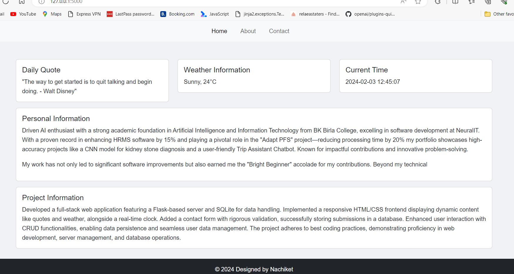
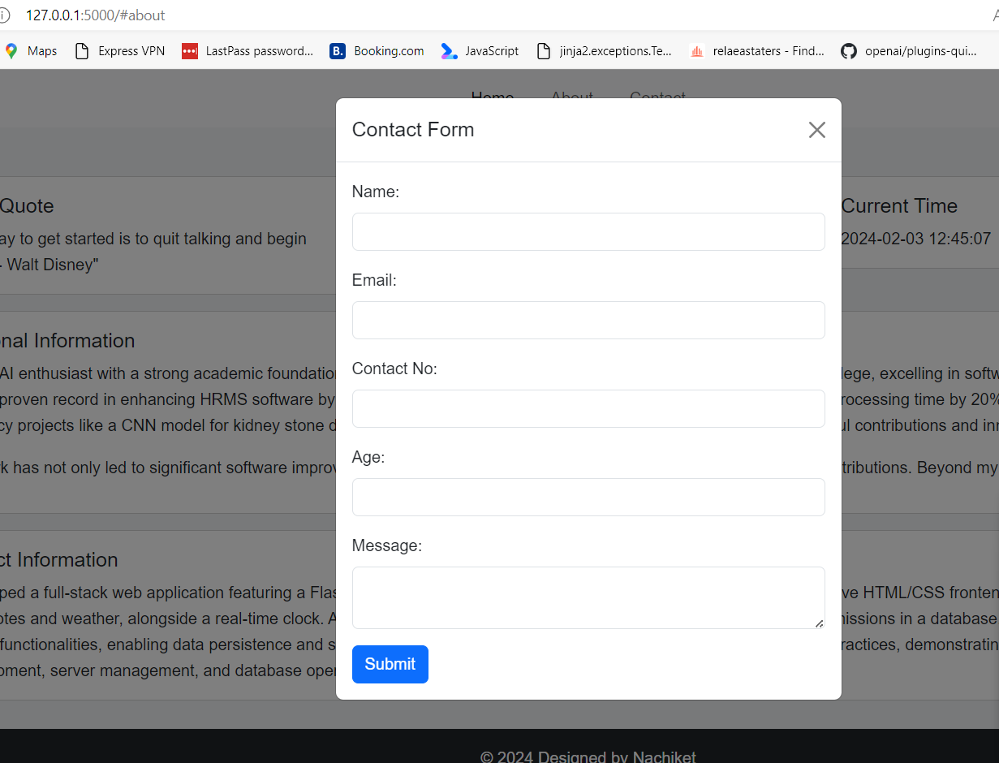
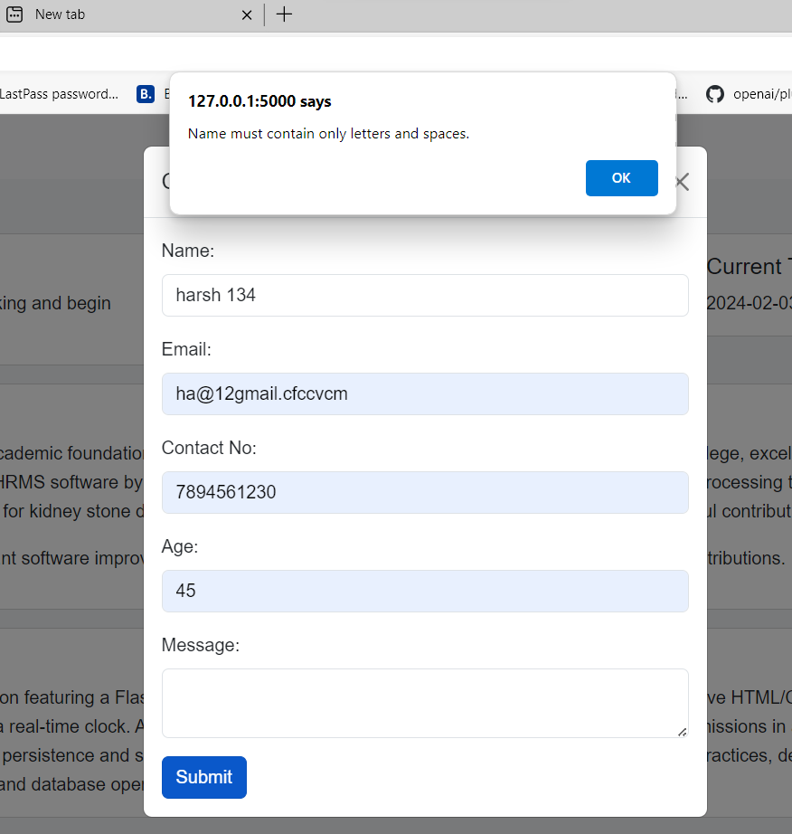
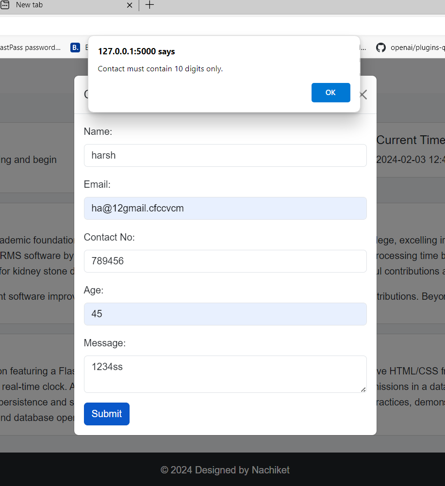
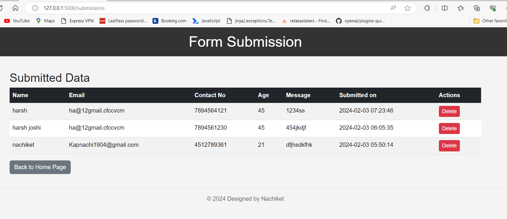

# Flask Contact Form Project

## Project Overview

This Flask application serves as a dynamic web platform, featuring a contact form for user data collection. It showcases form handling, data persistence through SQLite, and user interaction via alerts and data submissions display.

## Features

- **Home Page:** Dynamically displays quotes, weather information, and the current time.
- **Contact Form:** Collects user data including name, email, contact number, age, and a message.
- **Data Handling:** Validates form data on the client-side and displays alerts for incorrect inputs.
- **Submissions Page:** Lists all the data submitted through the form, stored in an SQLite database.
- **Deletion Capability:** Allows for the removal of submissions directly from the Submissions page.

## Setup and Installation

1. **Clone the repository:**
   ```sh
   git clone https://your-repository-url.git
   cd your-project-folder
   ```

2. **Set up a virtual environment (Optional but recommended):**
   ```sh
   python -m venv venv
   source venv/bin/activate  # On Windows use `venv\Scripts\activate`
   ```

3. **Install required packages:**
   ```sh
   pip install -r requirements.txt
   ```

4. **Initialize the database:**
   ```sh
   flask db upgrade
   ```

5. **Run the application:**
   ```sh
   flask run
   ```

## Screenshots

Below are screenshots showcasing the application's main features:

- **Home Page**

  

- **Contact Form**

  

- **Data Handling and Alerts**

  
    

- **Submissions Page**

  

## Technologies

- **Frontend:** HTML, CSS, Bootstrap
- **Backend:** Flask (Python)
- **Database:** SQLite
- **Validation:** JavaScript

## Contributions

Contributions are welcome! For major changes, please open an issue first to discuss what you would like to change.

